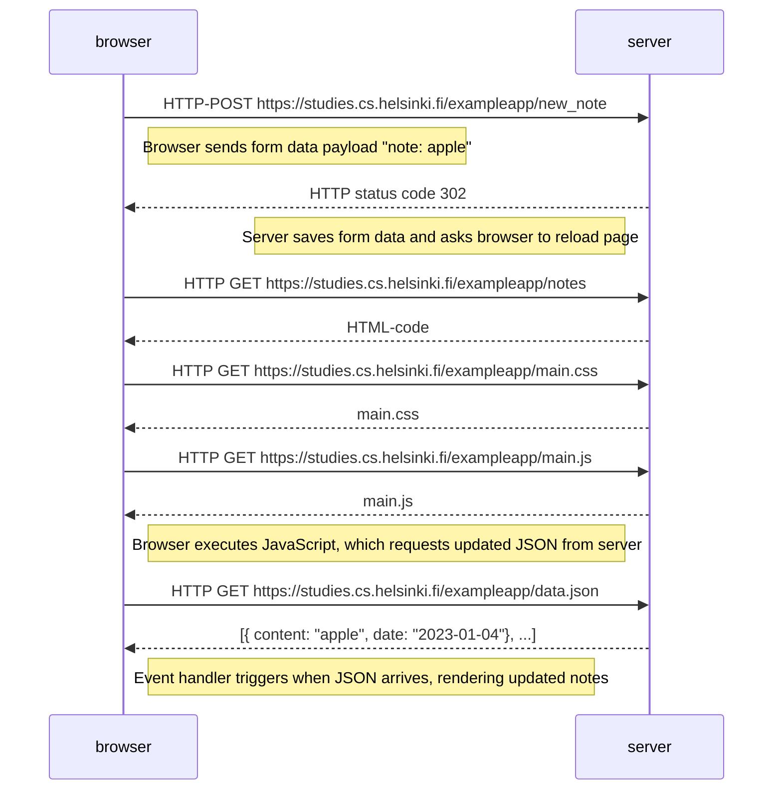

```mermaid

    sequenceDiagram
        browser->>server: HTTP-POST https://studies.cs.helsinki.fi/exampleapp/new_note
        Note right of browser: Browser sends form data payload "note: apple"
        server-->>browser: HTTP status code 302
                Note left of server: Server saves form data and asks browser to reload page
        browser->>server: HTTP GET https://studies.cs.helsinki.fi/exampleapp/notes
        server-->>browser: HTML-code
        browser->>server: HTTP GET https://studies.cs.helsinki.fi/exampleapp/main.css
        server-->>browser: main.css
        browser->>server: HTTP GET https://studies.cs.helsinki.fi/exampleapp/main.js
        server-->>browser: main.js
        Note right of browser: Browser executes JavaScript, which requests updated JSON from server
        browser->>server: HTTP GET https://studies.cs.helsinki.fi/exampleapp/data.json
        server-->>browser: [{ content: "apple", date: "2023-01-04"}, ...]
        Note right of browser: Event handler triggers when JSON arrives, rendering updated notes
```
