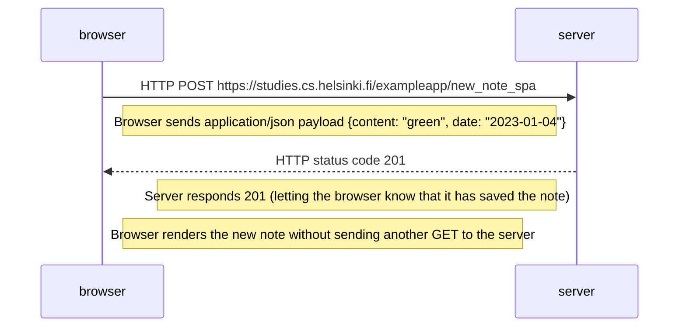

```mermaid

sequenceDiagram
        browser->>server: HTTP POST https://studies.cs.helsinki.fi/exampleapp/new_note_spa
        Note right of browser: Browser sends application/json payload {content: "green", date: "2023-01-04"}
        server-->>browser: HTTP status code 201
        Note left of server: Server responds 201 (letting the browser know that it has saved the note)
        Note right of browser: Browser renders the new note without sending another GET to the server
```