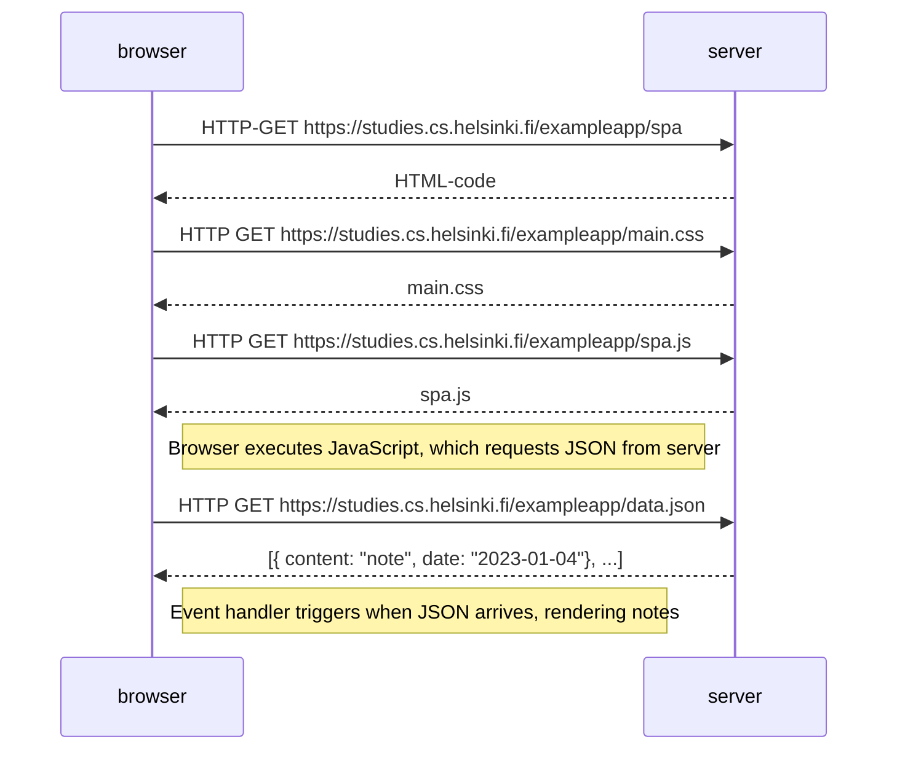

```mermaid

sequenceDiagram
        browser->>server: HTTP-GET https://studies.cs.helsinki.fi/exampleapp/spa
        server-->>browser: HTML-code
        browser->>server: HTTP GET https://studies.cs.helsinki.fi/exampleapp/main.css
        server-->>browser: main.css
        browser->>server: HTTP GET https://studies.cs.helsinki.fi/exampleapp/spa.js
        server-->>browser: spa.js
        Note right of browser: Browser executes JavaScript, which requests JSON from server
        browser->>server: HTTP GET https://studies.cs.helsinki.fi/exampleapp/data.json
        server-->>browser: [{ content: "note", date: "2023-01-04"}, ...]
        Note right of browser: Event handler triggers when JSON arrives, rendering notes
```